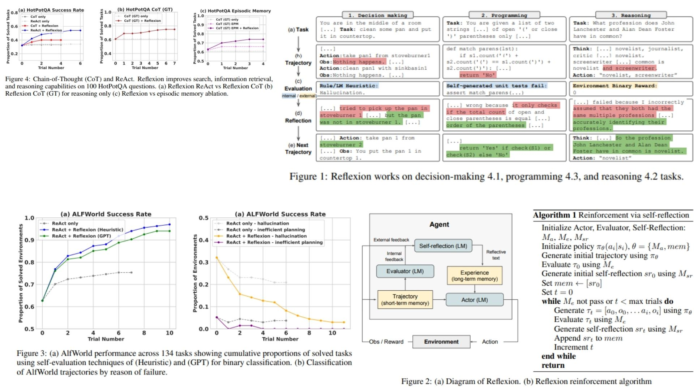

# 🤖 Reflexion-Agent-Replication — Self-Reflective Vision Agent

This repository provides a **PyTorch-based research replication** of  
**Reflexion: Language Agents with Verbal Reinforcement Learning — Nakano et al., 2023**,  
adapted into a **vision reasoning framework**.

The project translates the paper’s **self-reflection loop, memory integration, and reward evaluation**
into a modular vision agent pipeline.

- Enables **iterative multi-step reasoning over visual features** 🧩  
- Integrates **short-term and long-term memory for reflection** 🪞  
- Supports **trajectory evaluation and reward-driven self-improvement** ⚡  

**Paper reference:**  [Reflexion: Language Agents with Verbal Reinforcement Learning — Nakano et al., 2023](https://arxiv.org/abs/2303.11366) 📄

---

## 🌌 Overview — Reflexion Vision Pipeline



The core idea:

> Reasoning emerges from reflection, not from a single forward pass.

Instead of mapping an image directly to a prediction:

$$
x \longrightarrow y
$$

We reformulate inference as a **self-reflective search process**:

$$
s_0 \rightarrow s_1 \rightarrow s_2 \rightarrow \dots \rightarrow s_T
$$

where each state $s_t$ encodes a **trajectory of reasoning with past reflections**.

The final prediction is obtained by selecting the action with the highest expected reward:

$$
y = H(s_T^*)
$$

with

$$
s_T^* = \arg\max_{s_T \in \mathcal{S}_T} R(s_T)
$$

Here, $R(s_T)$ is computed by the **evaluator**, integrating both task success and reflection-based learning. (We did not implement that part.)

---

## 🔬 Mathematical Formulation

Let an input image be encoded as

$$
z_0 = E(x)
$$

where  
- $x$ is the input image  
- $E(\cdot)$ is a vision encoder (CNN / ViT / CLIP)  
- $z_0$ is the initial reasoning state  

At each reasoning step $t$, the agent produces an action $a_t$ using its memory-informed policy:

$$
a_t \sim \pi_\theta(a \mid s_t, M)
$$

where $M$ is the **long-term reflection memory**.

The environment returns a reward signal:

$$
r_t = R(s_t, a_t)
$$

After a trajectory of length $T$, the agent generates a **reflection**:

$$
f(\tau, r, M) = \text{ReflectionGenerator}(\tau, r, M)
$$

This reflection updates the long-term memory:

$$
M \leftarrow M \cup f(\tau, r, M)
$$

---

## 🧠 What the Model Learns

- To evaluate its own reasoning trajectories 🪞  
- To leverage past reflections in generating next actions 🔄  
- To assign credit via reward for correct visual reasoning ⚡  
- To suppress premature or low-value decisions ❌  
- To gradually improve through self-reflective iterations 🌱  

The inference loop becomes a **reward-driven, reflection-augmented reasoning process** rather than a single-shot mapping.

---

## 📦 Repository Structure

```bash
Reflexion-Agent-Replication/
├── src/
│   ├── actor/
│   │   └── actor.py                  # State → Action / Generation (LLM policy)
│   │
│   ├── evaluator/
│   │   └── evaluator.py              # Trajectory → Reward / Pass-Fail / Score
│   │
│   ├── reflection/
│   │   └── reflection_generator.py   # (Trajectory, Reward, Memory) → Reflection text
│   │
│   ├── memory/
│   │   ├── short_term.py             # Trajectory buffer (current episode)
│   │   └── long_term.py              # Reflection memory (episodic memory)
│   │
│   ├── environment/
│   │   └── env_interface.py          # Task wrapper (game, vision, reasoning, etc.)
│   │
│   ├── policy/
│   │   └── policy.py                 # πθ = Actor + Memory (prompt builder)
│   │
│   ├── pipeline/
│   │   └── reflexion_pipeline.py     # Full Reflexion loop controller
│   │
│   └── config.py                     # MAX_TRIALS, MEMORY_SIZE, MODEL_NAME
│
├── images/
│   └── figmix.jpg                     
│
├── requirements.txt
└── README.md
```
---


## 🔗 Feedback

For questions or feedback, contact: [barkin.adiguzel@gmail.com](mailto:barkin.adiguzel@gmail.com)
